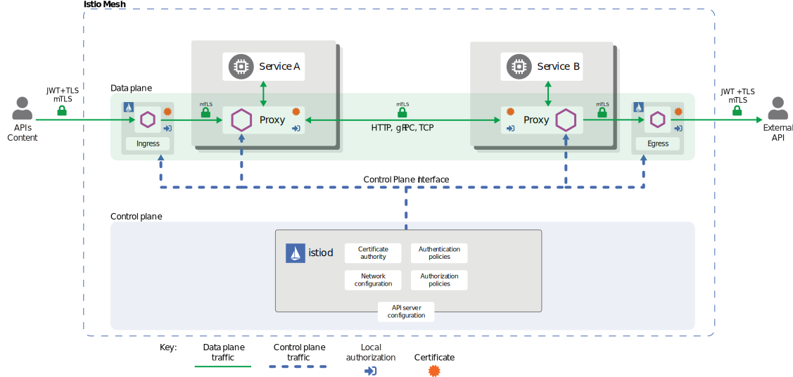

### Service Meshes for Infrastructure/DevOps Teams: An Introduction

Service meshes as a concept have been gradually growing in perception and usage over the past year or so.  You may have heard the term mentioned in relation to containers, or microservices, or Kubernetes, or any number of other industry buzzwords.  Possibly you have a team of developers that is starting a new containerized project, and to properly support them you need some visibility and control over their traffic -- or you may have seen cloud providers beginning to offer their own service mesh products and been curious.  

But what are service meshes?  What makes them different from the way it's always been done? And most importantly, why should you care?

In this first article I'm going to propose some answers to those questions. And then I'm going to try and convince you that service meshes will not only be incredibly important for developers, but can also be considered a next generation of security and network capabilities for the operations side.

_Note: we will be primarily discussing service meshes based off of the [Envoy proxy](https://www.envoyproxy.io/) created by Lyft.  These include istio, AWS App Mesh, and Google Cloud Traffic Manager._

First, let's have a little look at how things are usually done today.

### The Perils of Julia

###  What it is, how it works, and why it's cool.

#### The mesh as a whole
A service mesh at it's most fundamental level is a _network overlay_.  Network traffic that crosses the service mesh still rides on traditional switches and routers (or their cloud analogues), but that traffic is encapsulated within another layer that the lower level devices do not see into.  You might compare it to putting a letter into an envelope and mailing it.  The sender and recipient can read the letter, but the mail system just passes the envelope around.  

This is most analagous in the networking world to a typical [VXLAN implementation](https://en.wikipedia.org/wiki/Virtual_Extensible_LAN).  Traffic enters the mesh near the source, rides on top of existing infrastructure, and then leaves the mesh near the destination.  It differs from VXLAN however, in that it operates at layer 3 rather than layer 2,  the encapsulating "envelope" is TLS encryption, and instead of shared VTEPs there is an Envoy proxy instance per service endpoint.  

This has three important implications for the network and security teams:
1. All traffic in the mesh will be encrypted by default.
2. Some traditional security technologies (layer 2 IDS/IPS I'm looking at you here) will not function as desired on service mesh traffic due to that encryption.
3. Endpoints in a service mesh can be placed anywhere that has layer 3 connectivity with the other mesh endpoints (on premise, in the cloud, etc).

#### Individual members
So the mesh is made of individual endpoints that can all talk to each other over the mesh.   Each one of these endpoints is a running instance of the Envoy proxy.  Traffic that wants to go across the mesh is first sent to these proxy endpoints.

And here is where I'd say seventy percent of the service mesh magic is - the proxy. (Don't worry about the rest of the magic, we'll get there.)

Every "service endpoint" (_typically a container running parts of an application_) has it's own individual "proxy endpoint" (_Envoy running in another container_).  For one service endpoint to talk to another, they don't need to know anything beyond sending traffic to the proxy.  It's the proxy that handles everything else.

```
{Potential Diagram}
Endpoint A container ->##local##-> Envoy A container ->#####Service Mesh#####-> Envoy B container ->##Local##-> Endpoint B container
        \                                /                                            \                                /
                 Host A                                                                              Host B
  
```

This is one of the primary benefits to the developer of a service mesh.  All the complexities of coding in things like service discovery or retries - and even more complex things like circuit breakers and exponential backoff - is taken away.  You just need to send a request and receive it on the other side.

But this is also where the service mesh gains its powers for the operational side of things.  Because all the internal traffic goes through the endpoint proxies, they are a natural place to enforce security and network policy.  This can include things like the aforementioned circuit breaking, but can also be capabilities like fault injection, access control, global rate limiting, and even load balancing. 


#### The Control and Management Planes

Everything we've discussed so far would form what is considered in networking as the "Data Plane" - it's where the traffic flows.  Well every good Data Plane also has to have a "Control Plane" to tell it how to work, and a "Management Plane" so the enduser can configure everything.  

And for service meshes, those other two planes (consider them as one configuration point) is the other magical thirty percent.  Because all those individual envoy proxies that make up the mesh are all configured centrally.  Each one of our big three implementations goes about it a different way, but each one provides a centralized management function that is used to configure the entire mesh as a whole.

Here from the [istio security documentation](https://istio.io/docs/concepts/security/) is a diagram showing how thier control plane implementation interacts with the mesh endpoints.



This centralized control plane gives the operations side an ability to set policy for the mesh (usually via infrastructure as code on the management plane) that all existing and any new members receive.  These policy actions can be scoped globally, or per service, or other designations (_depends on implementation_).

Let me give you an example to illustrate:  
Your new microservice based application is beginning to experience issues.  The Devops team investigates and determines one of the core services is getting hammered by some new test code.  The team can update the service mesh to do global rate limiting on the service.  Every envoy proxy in the mesh will receive the configuration and begin to measure traffic to that service (_no matter how many containers it contains_) based on a global bucket and can throttle traffic locally before it ever gets onto the mesh...

As you can see, powerful and exciting capabilities!  And when you add in the observability that the service mesh adds as well (each envoy proxy can log for mesh wide tracing) you can begin to see why we at SingleStone Consulting are really starting to develop feelings for service meshes.

### Wrap Up

Hopefully that has given you a high level understanding of what a service mesh is and what it can do for you. For fear of spiraling into a long technical digression I will stop there for today.

My goal is to continue to get deeper into this subject with actual technical examples and in-depth discussions (starting with AWS App Mesh), so if that's of interest to you please keep your eyes out for followups!

As always, SingleStone Consulting would love to to help you with your cloud and devops needs.  Contact us, and let's talk about service meshes and how we can help you implement them in your favorite cloud or on-premise environment today.

It is my goal to get much deeper into the technical side of the three implementations I mentioned up top (istio, GCP Traffic Manager, AWS App Mesh) as I move along this blog series, so be on the lookout for following posts!

